# AI Comic Series｜高考回档：雨夜白月光

一个本地优先、AMD 云端执行的高质量 AI 漫剧生产工程。项目以《刚高考，但不满分就会回档》原文为素材，首个成片是一支约 `125.745` 秒的横屏试播集。

核心约束不是“导出 MP4 就算完成”：正式时间线中的 29 个剧情镜头必须全部来自真实 T2V/I2V 生成视频。静态漫画图的推拉、平移或缩放只能用于诊断草稿，不能进入最终视频。

## 当前交付契约

- `1920×1080`、30 fps、H.264/AAC 最终 MP4。
- 29 个真实生成视频镜头，42 条中文语义字幕，25 个原始语义节拍。
- 统一角色锚点、逐镜身份/手部/道具/运动检查，不合格镜头不进入时间线。
- 本地保留全部源码、提示词、配置、时间轴、启动命令、检查报告和最终成片。
- AMD 云端只保留可重建的运行时、模型缓存和 GPU 生成缓存。
- Git 管理源码与轻量资产；模型和大体积生成视频不提交 Git，但使用锁定清单、SHA-256 和元数据复现。

## 架构

```mermaid
flowchart LR
    A["本地原文 / SCRIPT_SOURCE.md"] --> B["SCRIPT.md + 真实 TTS/VTT"]
    B --> C["STORYBOARD_VIDEO.json\n29 个声画对齐镜头"]
    C --> D["本地 comicctl\n安全 Jupyter 控制层"]
    D --> E["AMD ROCm + ComfyUI\nQwen 锚点/关键帧"]
    E --> F["Wan 2.2 I2V\n真实视频镜头"]
    F --> G["本地 SHA 校验 / 逐镜 QA"]
    G --> H["HyperFrames + ASS\n字幕/系统层/音频/转场"]
    H --> I["最终 MP4 + 发布包 + QA 证据"]
```



远端不暴露 ComfyUI 公网端口。所有 ComfyUI 请求都由上传到 Jupyter 工作区的无密钥 worker 在 `127.0.0.1` 内部完成；本地通过 Jupyter Contents API 只同步小型控制文件和最终镜头镜像。

## 快速开始

要求：Windows PowerShell 7、Python 3.12+、Node.js 22+、Git、FFmpeg，以及可访问 AMD Jupyter 实例的浏览器会话。

```powershell
cd E:\code\nocel_ai_push\test3\AI_comic_series
.\scripts\setup-local.ps1
npm run build
```

### 1. 安全连接 AMD 云端

先在浏览器重新登录 AMD 平台。打开实例中的任意 Jupyter API 请求，在开发者工具中复制其完整 `Cookie` 请求头值，然后运行：

```powershell
.\scripts\remote.ps1 remote probe
```

脚本使用隐藏输入读取 Cookie，只放进子进程环境；不会写入命令历史、配置、日志或 Git。访问令牌到期时，控制器使用 AMD 前端同一 `/api/api/Auth/Refresh` 路径在内存中轮换 Cookie。

### 2. 初始化大容量盘上的 ROCm 运行时

```powershell
.\scripts\remote.ps1 remote bootstrap --wait --timeout 3600
```

引导程序会：

1. 自动选择至少有 100 GiB 空闲的最大非系统可写挂载；
2. 在该盘创建独立 venv、固定版本 ComfyUI、模型/缓存/输出目录；
3. 优先安装服务器根目录已有的 ROCm 7.2.1 PyTorch wheels；
4. 验证 `torch.version.hip`、可见 GPU 数量和实际显存；
5. 每张容器可见 GPU 启动一个本地 ComfyUI worker。

如需指定数据盘：

```powershell
.\scripts\remote.ps1 remote bootstrap --data-root /你的/大容量挂载/ai-comic-series --wait
```

### 3. 安装 SHA 锁定模型

```powershell
# 角色锚点与身份保持关键帧
.\scripts\remote.ps1 remote install-models --profile qwen-image-production --wait --timeout 14400

# 最终真实视频镜头
.\scripts\remote.ps1 remote install-models --profile wan22-i2v-14b-quality --wait --timeout 14400

# 可选：只做 ROCm/ComfyUI 快速冒烟，不用于最终质量
.\scripts\remote.ps1 remote install-models --profile wan22-ti2v-5b-smoke --wait --timeout 14400
```

模型的官方仓库 revision、文件大小与 SHA-256 均在 `config/models.json` 中固定。下载可恢复，已验证文件会复用。

### 4. 分阶段生成并下载

```powershell
# 四个身份锚点
.\scripts\remote.ps1 remote generate anchors --wait
.\scripts\remote.ps1 remote fetch generate-anchors

# 锚点通过后，29 张身份保持关键帧
.\scripts\remote.ps1 remote generate keyframes --wait
.\scripts\remote.ps1 remote fetch generate-keyframes

# 关键帧通过后，29 个 Wan 2.2 I2V 视频镜头
.\scripts\remote.ps1 remote generate videos --wait --timeout 28800
.\scripts\remote.ps1 remote fetch generate-videos
```

每个输出都有 `.meta.json`：生成类型、尝试次数、输入指纹、SHA-256、大小和视频 probe。无变化重跑会复用；只有失败或被拒绝的镜头需要换 seed/提示词后重做。

暂停与恢复不会删除已通过输出：

```powershell
.\scripts\remote.ps1 remote stop
.\scripts\remote.ps1 remote resume
```

## 可修改入口

| 想修改的内容 | 权威文件 | 重建命令 |
| --- | --- | --- |
| 原始故事 | `SCRIPT_SOURCE.md`（逐字保留、仅本地） | 先编辑改编稿；`SOURCE_MANIFEST.json` 验证原文身份 |
| 本集旁白 | `SCRIPT.md` | 重新运行 HBG narration builder |
| 角色脸、发型、服装、关系 | `CHARACTERS.md` + `production/characters.json` | `node scripts/build-generation-queue.mjs .` |
| 镜头内容、人数、风险 | `STORYBOARD_BASE.json` + `production/scene-overrides.json` | `npm run build:storyboard` |
| 视频动作 | `STORYBOARD_VIDEO.json` 中的 `motionTarget`（由 overrides 生成） | `npm run build:storyboard` |
| 画面色彩、字幕、字体 | `frame.md` + `HBG_STYLE.json` | `npm run build:composition` |
| 模型或版本 | `config/models.json` | 重新安装相应 profile |
| 转场连续性 | `ledger.json`（由 production docs builder 生成） | `node scripts/stamp-seams.mjs .` |
| 开场选镜 | `production/opening-plan.json` | `npm run build:opening` |
| 音乐/音效 | `PROJECT_SPEC.json` + `assets/audio/` | `npm run build:composition` |

完整修改规则见 [docs/EDITING.md](docs/EDITING.md)。

## 验证

本地代码门：

```powershell
.\.venv\Scripts\python.exe -m ruff check .
.\.venv\Scripts\python.exe -m mypy src
.\.venv\Scripts\python.exe -m pytest
```

声画门：

```powershell
node C:\Users\你的用户名\.codex\skills\hbg-life-simulation\scripts\audit_caption_semantics.mjs .
node C:\Users\你的用户名\.codex\skills\hbg-life-simulation\scripts\audit_voice_alignment.mjs . STORYBOARD_VIDEO.json 0.12
node C:\Users\你的用户名\.codex\skills\hbg-life-simulation\scripts\audit_storyboard_density.mjs STORYBOARD_VIDEO.json
```

最终媒体齐全后：

```powershell
node scripts/build-composition.mjs . --strict-assets
node scripts/stamp-seams.mjs .
npm run check -- --strict --snapshots
npm run render -- --quality high --output renders/gaokao-rewind-ep01-r001.mp4
```

`npm run check` 必须零错误；最终 MP4 还需逐镜接触表、黑帧、静音、响度、分辨率、帧率、时长、手部/道具高风险点和首尾帧检查。完整门槛见 [docs/QUALITY_GATES.md](docs/QUALITY_GATES.md)。

## Git 与大文件策略

- Git 跟踪源码、配置、文本、字幕、模型锁、轻量音频、字体、工作流、质量报告和最终哈希。
- 用户提供的 39 章原文不向公开 GitHub 再分发；本地保留 `SCRIPT_SOURCE.md`，仓库只提交 `SOURCE_MANIFEST.json` 的大小、章节数与 SHA-256。
- `models/`、远端缓存、关键帧、视频镜头、渲染中间帧和最终大 MP4 默认不进 Git。
- 每个阶段通过后提交一次；最终 MP4 可放 GitHub Release、对象存储或 Git LFS，并在仓库记录 SHA-256。
- 任何 Cookie、JWT、refresh token、API key、签名 URL 都禁止提交。

第三方模型、字体、音乐和音效许可见 [THIRD_PARTY.md](THIRD_PARTY.md)。
