# AI Comic Series｜高考回档：雨夜白月光

一个本地优先、AMD 云端执行的高质量 AI 漫剧生产工程。项目以《刚高考，但不满分就会回档》原文为素材，首个成片是一支约 `125.745` 秒的横屏试播集。

核心约束不是“导出 MP4 就算完成”：正式时间线中的 29 个剧情镜头必须全部来自真实 T2V/I2V 生成视频。静态漫画图的推拉、平移或缩放只能用于诊断草稿，不能进入最终视频。

## 当前交付契约

- `1920×1080`、30 fps、H.264/AAC 最终 MP4。
- 29 个真实生成视频镜头，42 条中文语义字幕，25 个原始语义节拍。
- 统一角色锚点、逐镜身份/手部/道具/运动检查，不合格镜头不进入时间线。
- 本地保留全部源码、提示词、配置、时间轴、启动命令、检查报告和最终成片。
- AMD 云端只保留可重建的运行时、模型缓存和 GPU 生成缓存。
- Git 管理源码与轻量资产；模型和大体积生成视频不提交 Git，但使用锁定清单、SHA-256 和元数据复现。

## 架构

```mermaid
flowchart LR
    A["本地原文 / SCRIPT_SOURCE.md"] --> B["SCRIPT.md + 真实 TTS/VTT"]
    B --> C["STORYBOARD_VIDEO.json\n29 个声画对齐镜头"]
    C --> D["一次 AMD/Jupyter 引导\n随后关闭 Jupyter"]
    D --> E["Bearer HTTPS 直连代理\n白名单同步/任务/取件"]
    E --> F["AMD ROCm + ComfyUI\nQwen 多参考锚点/关键帧"]
    F --> J["Wan 2.2 I2V + FLF2V\n真实视频镜头"]
    J --> G["本地 SHA 校验 / 逐镜 QA"]
    G --> H["HyperFrames + ASS\n字幕/系统层/音频/转场"]
    H --> I["最终 MP4 + 发布包 + QA 证据"]
```



远端不暴露 ComfyUI 公网端口。ComfyUI 只在 `127.0.0.1:18888+` 运行；公网仅有一个回环 control-agent 的临时 HTTPS 隧道，所有路由必须通过进程内 256-bit Bearer，且只允许同步固定目录、启动固定任务、读状态/日志、取回哈希绑定产物及可恢复停机，不提供 shell。Jupyter 只用于首次上传约几十 KiB 的网关并启动它，直连就绪后立即关闭。

## 快速开始

要求：Windows PowerShell 7、Python 3.12+、Node.js 22+、Git、FFmpeg，以及可访问 AMD Jupyter 实例的浏览器会话。

```powershell
cd E:\code\nocel_ai_push\test3\AI_comic_series
.\scripts\setup-local.ps1
npm run build
```

### 1. 安全连接 AMD 云端

先在浏览器重新登录 AMD 平台。打开实例中的任意只读 Jupyter Contents API 请求，在开发者工具的 Network 面板中选择 **Copy → Copy as cURL**；不要只复制 Cookie。保持完整 cURL 在剪贴板中，然后运行：

```powershell
.\scripts\remote.ps1 remote probe
```

`remote.ps1` 从剪贴板读取完整 cURL，并只通过 Python 子进程的 stdin 导入；不会把它放入参数、环境变量、配置、临时文件、日志或 Git，也不会回显。也可以显式使用标准输入：

```powershell
Get-Clipboard -Raw | .\scripts\remote.ps1 remote probe
```

导入器同时验证并提取实例 URL、`Authorization`、完整 Cookie、`X-XSRFToken`、`User-Agent`、`Referer`、`Accept-Language` 和 `Accept`。它只接受官方 AMD HTTPS 主机、合法实例路径、同实例 Referer 和无请求体的 Contents API GET；XSRF header 必须与 Cookie 一致。控制器首先原样重放 cURL 中的 URL 做一次不跟随重定向的 GET 预检，只有 `2xx` 才执行后续动作。访问令牌到期时，控制器使用 AMD 前端同一 `/api/api/Auth/Refresh` 路径在内存中轮换 Cookie，并保留其余浏览器 header。

生产任务优先使用一次引导后完全切走 Jupyter 的直连会话入口：

```powershell
.\scripts\direct-session.ps1
```

出现 `"transport":"direct-https"` 与 `"jupyterClosed":true` 后，后续 JSON 命令、代码同步、模型下载、生成状态和成片取回均走 Bearer HTTPS。若只做 AMD 诊断，可使用旧的 Jupyter 长期会话入口：

```powershell
.\scripts\remote-session.ps1
```

直连会话使用与下文一一对应的 JSON 动作，例如：

```json
{"action":"bootstrap","dataRoot":"/ai-comic-series"}
{"action":"install-models","profile":"wan22-i2v-14b-quality"}
{"action":"generate","stage":"anchors","maxWorkers":8}
{"action":"status","job":"generate-anchors"}
{"action":"fetch","job":"generate-anchors"}
```

下文的 `remote.ps1` 仍作为可复制的一次性兼容命令；连续生产时应在 `direct-session.ps1` 中发送等价 JSON，避免再次依赖 Jupyter。

等待第一条 JSON 出现 `"session":"ready"` 且 `"preflight":{"status":200}` 后，输入单行命令，例如：

```json
{"action":"probe"}
{"action":"sync"}
{"action":"status","job":"bootstrap"}
{"action":"quit"}
```

长期进程只在内存中保存和轮换凭据。它的原生 stdin 协议是：完整多行 cURL、单独一行 `__AI_COMIC_CURL_END__`，其后才是逐行 JSON 控制命令。

### 2. 初始化大容量盘上的 ROCm 运行时

```powershell
.\scripts\remote.ps1 remote bootstrap --wait --timeout 3600
```

引导程序会：

1. 自动选择至少有 100 GiB 空闲的最大非系统可写挂载；
2. 在该盘创建独立 venv、固定版本 ComfyUI、模型/缓存/输出目录；
3. 优先安装服务器根目录已有的 ROCm 7.2.1 PyTorch wheels；
4. 验证 `torch.version.hip`、可见 GPU 数量和实际显存；
5. 每张容器可见 GPU 启动一个本地 ComfyUI worker。

如需指定数据盘：

```powershell
.\scripts\remote.ps1 remote bootstrap --data-root /你的/大容量挂载/ai-comic-series --wait
```

### 3. 安装 SHA 锁定模型

```powershell
# 角色锚点与身份保持关键帧
.\scripts\remote.ps1 remote install-models --profile qwen-image-production --wait --timeout 14400

# 最终真实视频镜头
.\scripts\remote.ps1 remote install-models --profile wan22-i2v-14b-quality --wait --timeout 14400

# 可选：只做 ROCm/ComfyUI 快速冒烟，不用于最终质量
.\scripts\remote.ps1 remote install-models --profile wan22-ti2v-5b-smoke --wait --timeout 14400
```

模型的官方仓库 revision、文件大小与 SHA-256 均在 `config/models.json` 中固定。下载可恢复，已验证文件会复用。

### 4. 分阶段生成并下载

```powershell
# 4 个身份锚点 + 7 个无人物地点锚（共 11 个）
.\scripts\remote.ps1 remote generate anchors --wait
.\scripts\remote.ps1 remote fetch generate-anchors
.\.venv\Scripts\python.exe -m scripts.approve_assets anchors --reviewer "Codex visual QA" --confirm-visual-review

# 同一已批准 IP 的双比例无字封面画面，再由本地添加精确中文标题
.\scripts\remote.ps1 remote generate cover-drafts --wait
.\scripts\remote.ps1 remote fetch generate-cover-drafts
.\scripts\remote.ps1 remote generate covers --wait
.\scripts\remote.ps1 remote fetch generate-covers
.\.venv\Scripts\python.exe -m scripts.approve_assets covers --reviewer "Codex visual QA" --confirm-visual-review
npm run build:covers

# 锚点通过后，29 张身份保持关键帧
.\scripts\remote.ps1 remote generate keyframes --wait
.\scripts\remote.ps1 remote fetch generate-keyframes
.\.venv\Scripts\python.exe -m scripts.approve_assets keyframes --reviewer "Codex visual QA" --confirm-visual-review

# 8 个动作关键镜头的审核末帧，用于 Wan FLF2V 首尾帧控制
.\scripts\remote.ps1 remote generate motion-keyframes --wait
.\scripts\remote.ps1 remote fetch generate-motion-keyframes
.\.venv\Scripts\python.exe -m scripts.approve_assets motion-keyframes --reviewer "Codex visual QA" --confirm-visual-review

# 先生成跨角色、手机、暴雨、救援和结尾反应的 10 镜头代表样片
.\scripts\remote.ps1 remote generate video-sample --wait --timeout 28800
.\scripts\remote.ps1 remote fetch generate-video-sample
.\.venv\Scripts\python.exe scripts\qa_generated_media.py --sample-only
.\.venv\Scripts\python.exe -m scripts.approve_assets video-sample --reviewer "Codex visual QA" --confirm-visual-review

# 代表样片通过率至少 90% 后，生成/复用全部 29 个 Wan 2.2 I2V 视频镜头
.\scripts\remote.ps1 remote generate videos --wait --timeout 28800
.\scripts\remote.ps1 remote fetch generate-videos
.\.venv\Scripts\python.exe scripts\qa_generated_media.py
.\.venv\Scripts\python.exe -m scripts.approve_assets full-videos --reviewer "Codex visual QA" --confirm-visual-review
```

每个输出都有 `.meta.json`：Comfy prompt ID、工作流 SHA-256、生成类型、尝试次数、输入指纹、输出 SHA-256、大小和视频 probe。无变化重跑会复用；审核文件绑定已看过资产的实际哈希，审核后文件变化会阻止下游生成。代表样片被拒绝的镜头在全量阶段强制重生成，不会错误复用。

`approve_assets` 的 `--confirm-visual-review` 不是自动验收开关：运行前必须打开完整接触表，并对高风险手部/手机/护栏/拉拽镜头查看原分辨率。可用 `--reject v2-s022:多余手掌` 明确拒绝；锚点或关键帧存在任何拒绝项时，下游门不会打开。

若 Qwen 第一遍关键帧存在伪字、额外设备、红色引导线或可局部清除的手部伪影，在 `production/keyframe-revisions.json` 为该场景声明 `mode: cleanup` 和精确缺陷，再运行 `npm run build:storyboard` 与 keyframes 阶段。第二遍使用坏图作为 picture 1、批准锚点作为 picture 2/3，只移除点名缺陷并保持姿态、相机、灯光和构图；旧版本自动归档到 `assets/generated/rejected/`。

暂停与恢复不会删除已通过输出：

```powershell
.\scripts\remote.ps1 remote stop
.\scripts\remote.ps1 remote resume
```

## 可修改入口

| 想修改的内容 | 权威文件 | 重建命令 |
| --- | --- | --- |
| 原始故事 | `SCRIPT_SOURCE.md`（逐字保留、仅本地） | 先编辑改编稿；`SOURCE_MANIFEST.json` 验证原文身份 |
| 本集旁白 | `SCRIPT.md` | 重新运行 HBG narration builder |
| 角色脸、发型、服装、关系 | `CHARACTERS.md` + `production/characters.json` | `node scripts/build-generation-queue.mjs .` |
| 固定地点几何与镜头映射 | `production/locations.json` | `node scripts/build-generation-queue.mjs .` |
| 镜头内容、人数、风险 | `STORYBOARD_BASE.json` + `production/scene-overrides.json` | `npm run build:storyboard` |
| 视频动作 | `STORYBOARD_VIDEO.json` 中的 `motionTarget`（由 overrides 生成） | `npm run build:storyboard` |
| 高危动作末帧 | `production/motion-endframes.json` | `node scripts/build-generation-queue.mjs .` |
| 画面色彩、字幕、字体 | `frame.md` + `HBG_STYLE.json` | `npm run build:composition` |
| 模型或版本 | `config/models.json` | 重新安装相应 profile |
| 转场连续性 | `ledger.json`（由 production docs builder 生成） | `node scripts/stamp-seams.mjs .` |
| 开场选镜 | `production/opening-plan.json` | `npm run build:opening` |
| 音乐/音效 | `PROJECT_SPEC.json` + `assets/audio/` | `npm run build:composition` |

完整修改规则见 [docs/EDITING.md](docs/EDITING.md)。

## 验证

本地代码门：

```powershell
.\.venv\Scripts\python.exe -m ruff check .
.\.venv\Scripts\python.exe -m mypy src
.\.venv\Scripts\python.exe -m pytest
```

声画门：

```powershell
node C:\Users\你的用户名\.codex\skills\hbg-life-simulation\scripts\audit_caption_semantics.mjs .
node C:\Users\你的用户名\.codex\skills\hbg-life-simulation\scripts\audit_voice_alignment.mjs . STORYBOARD_VIDEO.json 0.12
node C:\Users\你的用户名\.codex\skills\hbg-life-simulation\scripts\audit_storyboard_density.mjs STORYBOARD_VIDEO.json
```

最终媒体齐全后：

```powershell
.\scripts\render-final.ps1 -Revision r001
```

`npm run check` 必须零错误；最终 MP4 还需逐镜接触表、黑帧、静音、响度、分辨率、帧率、时长、手部/道具高风险点和首尾帧检查。完整门槛见 [docs/QUALITY_GATES.md](docs/QUALITY_GATES.md)。

## Git 与大文件策略

- Git 跟踪源码、配置、文本、字幕、模型锁、轻量音频、字体、工作流、质量报告和最终哈希。
- 用户提供的 39 章原文不向公开 GitHub 再分发；本地保留 `SCRIPT_SOURCE.md`，仓库只提交 `SOURCE_MANIFEST.json` 的大小、章节数与 SHA-256。
- `models/`、远端缓存、关键帧、视频镜头、渲染中间帧和最终大 MP4 默认不进 Git。
- 每个阶段通过后提交一次；最终 MP4 可放 GitHub Release、对象存储或 Git LFS，并在仓库记录 SHA-256。
- 任何 Cookie、JWT、refresh token、API key、签名 URL 都禁止提交。

第三方模型、字体、音乐和音效许可见 [THIRD_PARTY.md](THIRD_PARTY.md)。
